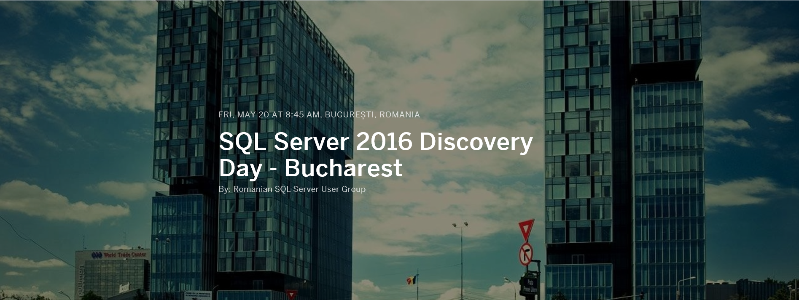

# SQL Server 2016 Discovery Day - Bucharest

 

## Resources for Participants

1. [Click here to set up your SQL Server 2016 environment](Setup/README.md)
2. [Click here to download the PASS sample data](resources/SQL2016DiscoveryDataV2.xlsx)

## Event Description

[Event Registration Page](https://www.eventbrite.com/e/sql-server-2016-discovery-day-bucharest-tickets-25265660270)

Please join Romanian SQL Server User Group for a special event - *The SQL Server 2016 Discovery Day* on May 20, 2016 at Microsoft Romania.  
This won’t be your ordinary group event - you will be asked to participate and help solve a problem using SQL Server and PASS data. Towards the end of the day, you’ll present these ideas to the group and the winning team will receive prizes! 

Our agenda is:

- 8:45 AM Registration
- 9:00 AM Introduction 
- 9:30 AM Presentations
- 10:30 AM Break 
- 10:45 AM Presentations Continuation
- 11:30 AM Breaking into Groups/Idea Development 
- 12:30 PM Lunch
- 1:00 PM Solution Development
- 2:30 PM Break
- 4:00 PM Show & Tell 
- 4:45 PM Wrapping Up
- 5:00 PM Close

Schedule is subject to change without notice.
