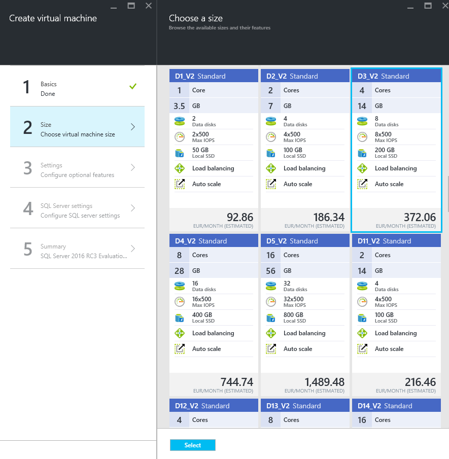

[Back to Menu](../README.md)

#Setup - Create a Free Azure Subscription and set up SQL Server 2016 Virtual Machine

This section covers the following topics:

1. [Get a free Azure Subscription](#1)
2. [Setup SQL Server 2016 Virtual Machine](#2)
3. [Install additional SQL Server features](#3)

#1. Get a free Azure Subscription

In order to create a free Azure Subscription, you can either use 

- the free monthly Azure credit which comes with the (also free) [Visual Studio Dev Essentials](https://azure.microsoft.com/en-gb/pricing/member-offers/vs-dev-essentials/) offer.
- a [Microsoft Azure Pass](http://www.microsoftazurepass.com/) - provided you have received a code from Microsoft representatives or partners
- a standard [Azure free trial](https://azure.microsoft.com/en-us/free/).

## 1a. Sign up for Visual Studio Dev Essentials.

[Visual Studio Dev Essentials](https://azure.microsoft.com/en-gb/pricing/member-offers/vs-dev-essentials/) is a free bundle from Microsoft which offers developers the chance to experiment and learn with MS-ecosystem solutions like: Azure, Xamarin, Visual Studio, Visual Studio Team Services and so on.

Follow the link above to sign up for Visual Studio Dev Essentials and activate your free Azure benefits.

## 1b. Use a Microsoft Azure Pass

By using a [Microsoft Azure Pass](http://www.microsoftazurepass.com/) code, you can create a free trial subscription without the need of a credit card.

You need the following:

* A Microsoft account - [click here](https://www.microsoft.com/en-us/account/) to get one for free

* A Microsoft Azure Pass code

Once you have those, follow the steps below to get your subscription. The [Azure Pass Howto](https://www.microsoftazurepass.com/howto) is available if you need more information.

1. Navigate to [http://www.microsoftazurepass.com/](http://www.microsoftazurepass.com/).

2. Select your country of residence and enter the code.

3. Hit **Submit**. 

4. On the next screen, click **Sign In** and log in with your Microsoft Account, if you weren't already logged in.

5. Fill in the form and click **Activate** to activate your Azure Pass.

## 1c. Get an Azure Trial subscription

Alternatively, you can get a standard trial subscription for Microsoft Azure, to use in order to test any services currently available in the Microsoft cloud. 

Navigate to the [Azure portal](https://azure.microsoft.com/en-us/free/) and follow the instructions in order to obtain a free Azure trial.

## 2. Setup SQL Server 2016 Virtual Machine

Once you have access to your Azure subscription, you can provision a new SQL Server 2016 VM in just a few minutes, by using the image Microsoft provides within the Azure Marketplace.

1. Login to the [Azure portal](https://portal.azure.com)
2. Create a new Marketplace image. 

	
 
3. Search for **SQL Server 2016** and select **SQL Server 2016 RC3 Evaluation on Windows Server 2012 R2**.
 
	

4. In the **Select a deployment model** option box, make sure **Resource Manager** is selected and click **Create**.

	 

5. Fill in the VM information. 

    The **Basics** Tab

    * For Name you can enter **SQLServer2016** or whatever name you prefer to use for your Virtual Machine.
    * The User name and Password will be used to access the machine via Remote Desktop.
    * For Resource Group, enter **SQLServer2016**
    * For Location, you can choose any available Azure Region - we recommend **West Europe**.

	

    The **Size** Tab

    * In the Size tab, click **View All**, select **D3_V2 Standard** and click **Select**. 

	

    The **Settings** Tab

    * In the Settings tab, leave the default settings and click **OK**. 

    The **SQL Server settings** Tab

    * In the SQL Server settings tab, leave the default settings and click **OK**. 

    The **Summary** Tab

    * In the Summary tab, review the VM settings and click **OK**. 

	

6. Hit **OK** and wait for the Virtual Machine to be provisioned. This usually takes several minutes to complete.

7. Once the Virtual Machine has been created, it's time to connect to it. 

You can find your machine in the **Virtual Machines** or **All Resources** sections of the Azure Portal.

Click the Virtual Machine, then click the **Connect** button. 

This will download a RDP (Remote Desktop Connection) file. Click **Open** to open the connection dialog.

Enter your username and password in the connection window. 

Once the connection has been established, you can run SQL Server Management Studio from within the VM itself,  and connect to your new SQL Server 2016 instance.

#3. Install additional SQL Server features

If after creating the Virtual Machine you need to install additional SQL Server features (for example PolyBase or R Services), follow these steps:

- Launch **SQL Server 2016 RC3 Installation Center (64-bit)**
- In the Installation Center screen, select **New SQL Server stand-alone installation or add features to an existing installation**.

- You will be prompted to select the SQL Server installation media location. 

> Note: The SQL Server installation kit can be found inside **C:\SQLServer_13.0_Full**

- In the **Installation Type** screen, select the Add features... option.

- In the **FeatureSelection** screen, check the additional features you require.

[Back to Main Page](../README.md)